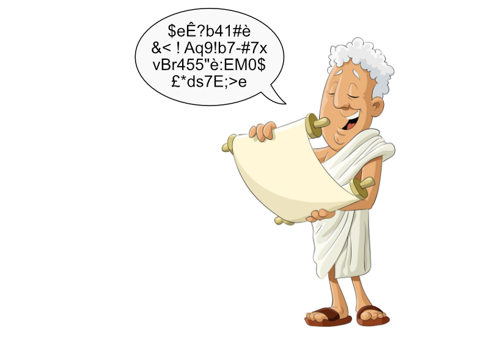
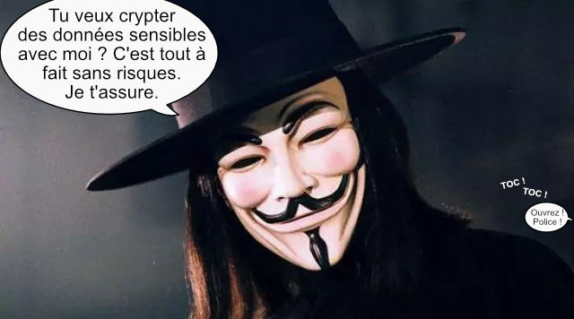
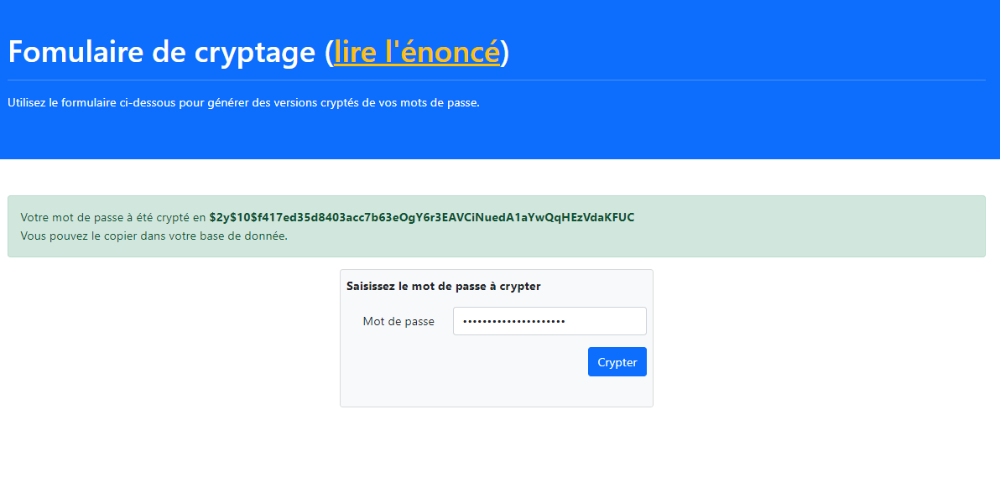

###### PHP - programmation avancée

# Sécurisation du formulaire de connexion

## Point de départ de l'exercice

Le commencement de cet exercice est très exactement le résultat final du précédent.

**Donc :**

- si vous avez réussi à tout coder de l'exercice précédent et que tout fonctionne, vous pouvez partir de vos propres fichiers, pensez juste à récupérer ce readme.
- si tout ne fonctionne pas parfaitement, mieux vaudrait peut-être partir des fichiers fournis, qui sont la correction de l'étape précédent.

**En plus :**

Un nouveau fichier fait son apparition :

- **crypt.php** : ce fichier n'a pas vocation à rester sur le site, il va juste nous aider à un moment, puis il pourra être supprimé.

## Un peu de culture générale (ça fait jamais de mal)

### Origines du chiffrement

Le chiffrement, ou cryptage, est une technique de cryptographie qui ne date pas d'hier puisque, semble-t-il, le plus ancien document crypté connu daterait du, tenez vous bien, XVI^e^ siècle av. J.-C. 

En Irak, un potier, pour ne pas oublier sa recette secrète mais qu'elle ne soit pas compréhensible par n'importe qui, l'avait gravée sur une tablette d'argile en supprimant certaines consonnes et en modifiant l'orthographe des mots.

Seul lui, connaissant la *clé*, pour décrypter le document, était en mesure de le lire.

### Arme de guerre

Pendant très longtemps le chiffrement fut très mal vu par les gouvernements et surtout leurs services de renseignement (étonnant !).

Ainsi, en France, jusqu'en 1996, le chiffrement était considéré comme une arme de guerre de deuxième catégorie. C'est à dire comme étant du matériel destiné spécifiquement à faire la guerre. En bref, un truc à ranger entre l'étagère "char d'assault" et celle pour les armes biologiques, donc totalement prohibé.

Heureusement, les services de renseignement se sont un peu détendus depuis et il est maintenant autorisé d'utiliser ce genre d'outils, quoique avec l'obligation de passer par un tiers de confiance accrédité par l'état... Ben oui, quand même.

Nous ne serons pas trop embêtés dans notre cas puisque, s'agissant juste de crypter un mot de passe, nous pouvons le faire librement... Ça ne serait pas du tout la même chose si nous décidions, par exemple, de crypter l'ensemble des données de notre base de données.

## Comment ça marche

**En chiffrement il nous faut deux choses :**

- **un algorithme de chiffrement :** c'est à dire une méthode, mathématique en principe, de codage de l'information d'origine. Bien sûr plus cet algorithme est **"lourd"** et mieux c'est, mais on ne peut baser un cryptage uniquement sur un algorithme car on part du principe que l'ennemi connait cet algorithme.
- **une clé :** c'est un code unique que l'on ajoute à l'agorythme à chaque nouveau codage et que seul l'emetteur et le destinataire connaissent. En informatique, on appelle cela le *sel*. Si on le change, cela modifie complètement la façon dont l'agorithme code l'information.

On appelle cela **"hasher"** un mot de passe.

Heureusement pour nous, PHP prévoit tout ce qu'il faut :

- la fonction [password_hash()](https://www.php.net/manual/fr/function.password-hash) : permet de hasher un mot de passe en utilisant un certain algorithme et un certain sel
- la fonction [password_verify()](https://www.php.net/manual/fr/function.password-verify) : permet de vérifier si un mot de passe en clair et un mot de passe hashé correspondent
- la fonction [random_bytes()](https://www.php.net/manual/fr/function.random-bytes) : permet d'obtenir un certain nombre d'octets aléatoires sécurisés, c'est une sorte de super fonction **rand()**, suffisament sécurisée pour qu'on puisse s'en servire en cryptographie.
- la fonction [bin2hex()](https://www.php.net/manual/fr/function.bin2hex) : qui va nous permettre de convertir les octets aléatoires de [random_bytes()](https://www.php.net/manual/fr/function.random-bytes) en code hexa, pour notre sel, c'est quand même plus lisible pour nous humains... quoique.

## Modification de la vérification du mot de passe

Comme vous l'avez vu dans l'exercice précédent, la base de données contient deux comptes utilisateurs avec les mots de passes en clair et six autre comptes avec des mots de passe étrangement complexes. Ce sont des versions cryptés, avec sel, de vrais mots de passe.

**Voici la liste de ces six comptes :**

- thegreatparis@imf.com / parisIStheGREATEST
- m.phelps@imf.com / MisterPhelps
- barney@imf.com / G33|<-0f-1MF
- cinnamon@imf.com / c1nnAm0n/
- doug@imf.com / th3D0ct0R...
- dana@imf.com / D4n4-l4mb3rt

Il va falloir modifier la fonction **user_connect()** du modèle **"users.model.php"** pour que ces six utilisateurs puissent se connecter.

**La manoeuvre est très simple :**

Remplacez la condition qui teste que les deux mots de passe (celui reçu en argument et celui de la BDD) sont identiques par un appel à **password_verify()**. 

> ⚠️ **Attention !** La fonction renvoie **true** si les deux sont égaux, on veut savoir qu'ils ne le soient pas.

Une fois cette petite modification effectuée, vous devriez pouvoir vous connecter avec n'importe lequel des six comptes sécurisés.

## Cryptage des mots de passe

> ⚠️ **Avertissement !** Dans les dernières versions de PHP, l'ajout de sel lors du cryptage se faire de manière systématique et automatisée. Il n'est donc pas nécessaire pour le développeur de le faire lui-même. 
Toutefois, ce n'est pas le cas sur toutes les versions de PHP, ni dans d'autres langages. Et, quand bien même, cela ne concerne que les mots de passe, quid si demain vous devez crypter un message de bout en bout qui ne soit pas un mot de passe ? Il vous faudra bien du sel. Donc, nous allons faire ici comme ci PHP ne le faisait pas tout seul. 

Bien, nous avons maintenant deux comptes non sécurisés en base de donnée. Il va falloir les sécurisé en cryptant leur mots de passe.

Normalement, cela se fait lors de l'inscription, mais nous n'allons pas faire un formulaire d'inscription juste pour ça.

C'est là que le fichier **"crypt.php"** va vous servir. 

Il s'agit d'un simple champ de saisie de type mot de passe, dans lequel vous allez pouoir saisir le mot de passe en clair, puis, après envoi, un message vous donnera la version cryptée de celui-ci.

***Vous devrez obtenir ceci :**

> ⚠️ Si vous avez également un message d'erreur ou un warning vous disant que l'usage de "salt" est déprécié, ce n'est pas un problème, ignorez-le.

Le fichier **"crypt.php"** contient tout ce qu'il vous faut, y comprit le **phtml**.

**Il va falloir :**

- Récupérer le mot de passe saisi dans le formulaire
- Créer un sel de 12 octets 
- Convertir le sel en héxadécimal
- Hasher (crypter) le mot de passe avec le bon sel
- Construire le message *"Votre mot de passe a été crypté en **VERSION HASHÉE** Vous pouvez le copier dans votre base de donnée"*

Une fois cet algo terminé, testez-le et remplacez les mots de passe non sécurisés de la base de donnée par leur versions cryptés.

Vous pourrez alors à nouveau vous connecter en utilisant les deux premiers comptes utilisateur.

**Félicitations ! C'en est fini du hashage de mots de passe. Ce n'était vraiment pas bien difficile.**

