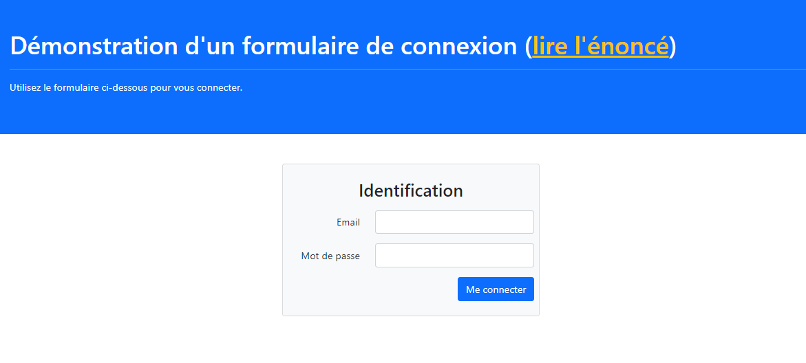
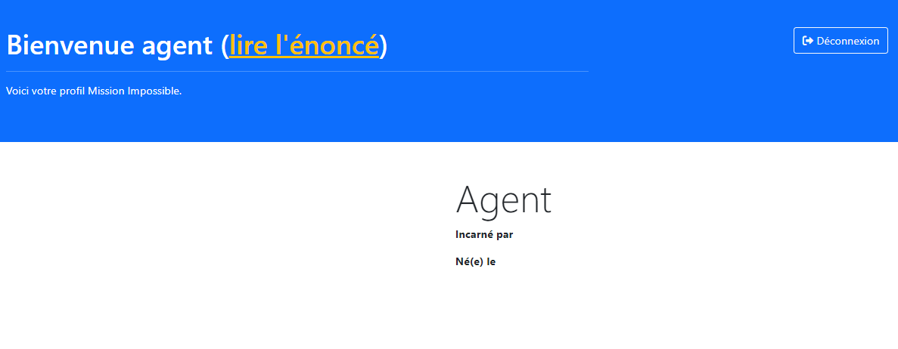

###### PHP - programmation avancée
# Création d'un formulaire de connection

## Petit rappel 

Vous vous rappelez de ça ?


**Avec :**

**1.** Le PHP de la page de connexion récupère l'email et le mot de passe saisis par l'utilisateur et demande à la base de données si cet utilisateur existe bel et bien.
**2.** Si l'utilisateur existe, la base de donnée renvoie son identifiant unique qu'ici nous appelerons *"uid"*.
**3.** La page de connexion, après vérification, stocke l'uid dans la session pour qu'il puisse y être retrouvé plus tard.
**4.** L'utilisateur peut aller sur n'importe quelle page du site et choisit d'aller sur sa page de profil. Celle-ci va récupérer l'uid dans la session.
**5.** La page profil, munie de l'uid, demande à la base de données quelles sont les datas associées à cet uid.
**6.** La base de données restitue les données de l'utilisateur qui sont ensuite affichées par la page de profil.

**Bon ben au boulot ! C'est à vous de le faire !**

## Détails de l'exercice

### Votre mission

Votre mission sera de créer un formulaire de connexion qui permette à des agents de Mission Impossible (*les originaux pas les imposteurs qui les ont plagié*) de se connecter avec un email et un mot de passe et d'accéder à une fiche *"profil"*, celle de l'agent qui s'est connecté.

**Les deux pages ressemblent pour le moment à ceci :**





Autant la page de connexion ressemble déjà à quelque chose, autant la page de profil est bien vide.

### Architecture de l'exercice

Vous trouverez ci-joints tous les fichiers nécessaires, vous n'avez pas à en créer un seul.

À vrai dire, vous n'avez même pas à créer de fonctions, elles sont toutes prêtes, à vous de les implémenter, et bien sûr de les appeler au bon moment et à bon escient.

**Voici l'achitecture de l'exercice :**

- **"index.php"** : le contrôleur du formulaire de connexion
- **"profil.php"** : le contrôleur de la page de profil
- **"logout.php"** : un controleur de déconnexion
- **"templates/index.phtml"** : le template du formulaire de connexion (tout prêt, pas touche)
- **"templates/profil.phtml"** : le template de la page de profil (pas touche non plus)
- **"model/database.php"** : juste la database globale, à configurer pour utiliser votre serveur MySQL en local
- **"model/users.model.php"** : un modèle de gestion de la table *"users"* qu'il va falloir utiliser pour se connecter
- **"lib/debug.php"** : juste pour faire du debug, au cas où.
- **"images/actors/"** : un dossier contenant des photos des acteurs de la série Mission Impossible (ouai, ça date pas d'hier)
- **"sql/imf.sql"** : le *"dump"* de la database à utiliser (importer) dans votre phpMyAdmin

Vous n'aurez à intervenir en réalité que dans :
- **"index.php"** : pour implémenter les demandes de connexion (via $_POST)
- **"profil.php"** : pour récupérer les infos de l'utilisateur connecté
- **"logout.php"** : pour gérer les demandes de déconnexion
- **"model/users.model.php"** : pour implémenter les fonctions nécessaires 

### À propos des datas

Il y'a une seule table dans la base de données, la table **"users"**. Mais toutes les données qui y sont enregistrées ne sont pas exploitable pour le moment.

Seuls deux comptes peuvent être utiliser au début à ses fins de tests :
- rollin@imf.com / rollinHandR0cks
- willy@imf.com / WillyTheBodybuilder#1

En effet, si vous regardez en base de données, vous verrez que les mots de passes des autres comptes sont bien étranges, nous aborderont ce sujet plus tard. Pour le moment, utilisez seulement ces deux comptes.

## Ordre conseillé

### 1. formulaire de connexion

#### 1.1. Charger les dépendances

Commencez par charger les dépendance au début du fichier.

Profitez-en pour tout de suite démarrer la session, comme ça c'est fait

#### 1.2 Réception du formulaire

Développer la condition qui permet de récupérer les données du [$_POST](https://www.php.net/manual/en/reserved.variables.post.php).

> ⚠️ **Attention**, il s'agit bien d'un gros ***if***, tout le code du contrôleur devra être dedans.
**Le principe est simple :** Si on a reçu des datas du formulaire, on les traites, sinon on ne fait rien d'autre que de charger le template *.phtml*.

Faites des debug pour vérifier.

#### 1.3 Implémenter la fonction de connexion

Dans **"users.model.php"**, il faut implémenter la fonction suivante :

```PHP
function user_connect(string $email, string $password):int {
    ...
}
```

Là aussi, les commentaires en pseudo code sont assez éxplicites pour ne pas avoir à détailler l'ensemble des lignes.

En gros, cette fonction va chercher l'utilisateur utilisant l'email ```$email``` et compare son mot de passe avec celui reçu en argument ```$password```.

Si l'utilisateur est trouvé, et que le mot de passe est conforme :
- la fonction enregistre son ```uid``` (identifiant d'utilisateur) en [session](https://www.php.net/manual/en/reserved.variables.session)
- et renvoie le ```uid``` de l'utilisateur par ```return```.

Sinon, la fonction renvoie 0, ce qui indiquera que l'utilisateur n'existe pas, ou que le mot de passe n'est pas le bon.

#### 1.4 Retour dans le controlleur "index.php"

Dans **"index.php"**, vous pouvez désormais implémenter l'appel à la fonction de connexion et vérifier si vous recevez bien un ```uid``` en retour, sinon, il faut faire un message d'erreur : *"Erreur : identifiants de connexion incorrects."*;

Si tout va bien, faites une [redirection](https://www.php.net/manual/en/function.header.php) vers la page de profil.

**Youpi ! Votre page de connexion est terminée !**


### 2. page profil

#### 2.1 Chargement des dépendances

Comme dans le formulaire de connexion, il faut charger les dépendances au début du fichier.

Ne touchez pas aux variables qui viennent juste après, elle servent pour le template *phtml*.

#### 2.2 Vérification de la connexion de l'utilisateur

Le principe d'un site avec connexion, c'est que l'on ne peut pas afficher certaines pages si on est pas correctement identifié.

Il faut donc implémenter la fonction ```user_isConnected()``` dans le model **"users.model.php"** :

```PHP
function user_isConnected():bool{ 
    ...
}
```

Celle-ci est très simple, elle vérifie juste si un **"uid"** se trouve bien en session, et renvoie ```true``` le cas échéant.

Ce qui, de retour dans **"profil.php"** vous permet de développer la condition qui vérifie si l'utilisateur est connecté, et qui, si ce n'est pas le cas, le [redirige](https://www.php.net/manual/en/function.header.php) automatiquement vers la page d'accueil.

#### 2.3 Implémentation de la fonction de récupération des infos de l'utilisateur

Cette fonction, toujours dans **"users.model.php"** ressemble à ceci :

```PHP
function user_getUserById(int $uid): array{
    ...
}
```

Elle doit récupérer un id d'utilisateur (**uid**) et exécuter la requête SQL qui permette de charger les infos de l'utilisateur.

Bien entendu, si aucune info n'est trouvée (parceque l'uid n'est pas bon), elle retourne un tableau vide.

> **⚠️ A noter :** La fonction prend bien soin de ne surtout pas renvoyer le mot de passe de l'utilisateur, ce serait une grave erreur de sécurité.

#### 2.4 Affichage des infos de l'utilisateur

De retour dans **"profil.php"** il suffit d'appeler la nouvelle fonction et de vérifier que des données ont bien été trouvées (si le tableau reçu n'est pas vide).

On peut ensuite charger les infos du tableau dans les variables prévues à cet effet pour les afficher dans le template.

> **⚠️ Attention :** il va falloir convertir la date dans un format plus lisible.

**🍾 Voilà, votre page de profil est enfin finie !** 


### 3. controlleur de déconnexion

Lorsque l'on clique sur le bouton de déconnexion, il faut pouvoir se déconnecter, c'est à dire détruire les variables de session. Pour cela on utilise un tout petit fichier PHP spécialisé dans cette seule tâche. Il s'agit du fichier **"logout.php'**.

Celui-ci est hyper simple, les commentaires que vous y trouverez sont explicites :

- D'abord on vide la session,
- Ensuite on fait une [redirection](https://www.php.net/manual/en/function.header.php) vers la page d'accueil.

Il faut juste bien penser à implémenter la fonction ```user_disconnect()``` du modèle **"users.model.php"**.

C'est tout.

## Ce dont vous aurez besoin

- **$_POST** : https://www.php.net/manual/fr/reserved.variables.post
- **$_SESSION** : https://www.php.net/manual/fr/reserved.variables.session
- **session_start()** : https://www.php.net/manual/fr/function.session-start
- **session_unset()** : https://www.php.net/manual/fr/function.session-unset
- **isset()** : https://www.php.net/manual/fr/function.isset
- **unset()** : https://www.php.net/manual/fr/function.unset

**Nouveautés** :

- **header('Location:...')** : https://www.php.net/manual/fr/function.header
- **die()** : https://www.php.net/manual/fr/function.die
- **ou exit()** : https://www.php.net/manual/fr/function.exit
- **empty()** : https://www.php.net/manual/fr/function.empty
- **date_create()** : https://www.php.net/manual/fr/function.date-create
- **date_format()** : https://www.php.net/manual/fr/function.date-format

## Mais encore

**Ben, c'est bien beau tout ça, mais ça ne va pas, mais alors pas du tout !**

Ce que nous venons de faire est, très exactement, ce qu'il ne faut surtout jamais faire : Notre système utilise des mots de passe en clair dans la BDD. Ça ne va pas du tout, il faut les crypter.

Ce sera justement l'objet du prochain exercice.